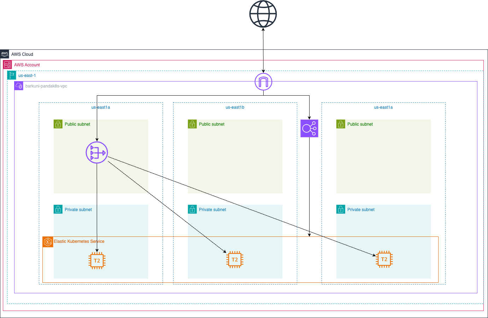
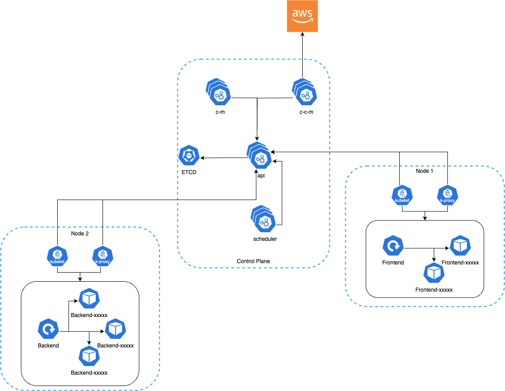

# 🐼 Pandak8s

Pandak8s is a GitOps-based monorepo designed to provision and manage a full-stack Kubernetes application using EKS, Argo CD, and GitHub Actions.

## 🔧 Project Overview

This repo sets up:

- An EKS Cluster (v1.29) on AWS using Terraform
- VPC with public and private subnets
- GitHub Actions integration via IAM OIDC for secure automation
- Argo CD installed and managed via Helm
- Automatic deployment of the `pandak8s` application through Argo CD

## Repository Structure

```
Vicarius/
├── .github/                 # GitHub Actions workflows
├── argocd/                  # Argo CD Helm chart and configuration
├── app/                     # Application source code
├── pandak8s/                # Kubernetes manifests
├── terraform/               # Terraform configuration
├── .gitignore
└── README.md
```

## ☁️ AWS Infrastructure

- **VPC** with NAT, 3 AZs, private & public subnets
- **EKS** with managed node group (t2.medium)
- **IAM OIDC** trust policy for GitHub Actions
- **Argo CD** Helm release in `argocd` namespace

## 🔁 CI/CD

- GitHub Actions assumes AWS role using OIDC
- Push to `main` branch triggers image builds and deployments
- Argo CD syncs `pandak8s` app from GitHub via Application resource

## 🚀 Deployment Path

1. Terraform provisions AWS infrastructure and Argo CD
2. Argo CD syncs the `pandak8s` app from GitHub
3. Application is deployed to EKS cluster

## Cloud Architecture Diagram

This diagram illustrates the AWS infrastructure deployed in the us-east-1 region.
- VPC: A dedicated Virtual Private Cloud named barkuni-pandak8s-vpc spans across multiple Availability Zones (AZs): us-east-1a, us-east-1b, and us-east-1c.
- Public and Private Subnets: Each AZ contains both public and private subnets. Public subnets are used for the NAT Gateway and Load Balancer, while private subnets host the EKS worker nodes.
- Internet Gateway: Enables public internet access for components like the Load Balancer.
- NAT Gateway: Deployed in the public subnet, allows instances in private subnets to access the internet securely.
- Elastic Load Balancer (NLB/ALB): Routes external traffic to services running in the EKS cluster.
- Amazon EKS: The Kubernetes control plane is managed by AWS, and the T2 worker nodes (managed node group) run within private subnets across AZs for high availability.
- EKS Nodes: Represented as T2 instances within the private subnets; they run the actual application workloads (pods).

## k8s Architecture Diagram

This diagram describes the internal Kubernetes architecture running on EKS.
- Control Plane:
    - API Server: Central management point for the Kubernetes cluster.
    - Scheduler: Assigns pods to nodes based on resource availability. 
    - Controller Manager (c-m): Handles node management, replication, and endpoint controllers.
    - Cloud Controller Manager (c-c-m): Manages cloud-specific controller logic (e.g., ELB). 
    - etcd: Stores all cluster configuration data.
- Worker Nodes (Node 1 & Node 2):
    - Kubelet: Agent running on each node, responsible for pod lifecycle management.
    - Kube Proxy: Handles network communication and maintains rules on each node.
    - Pods:
      - Frontend Deployment: Runs on Node 1. Consists of a main pod and replicas. 
      - Backend Deployment: Runs on Node 2. Consists of a main pod and replicas.


## 🔐 Secrets and Access

- GitHub Actions OIDC role is created for secure ECR/image operations
- Admin user is granted `system:masters` via `aws_auth_users`
- `CreateNamespace=true` allows Argo CD to deploy apps into new namespaces

